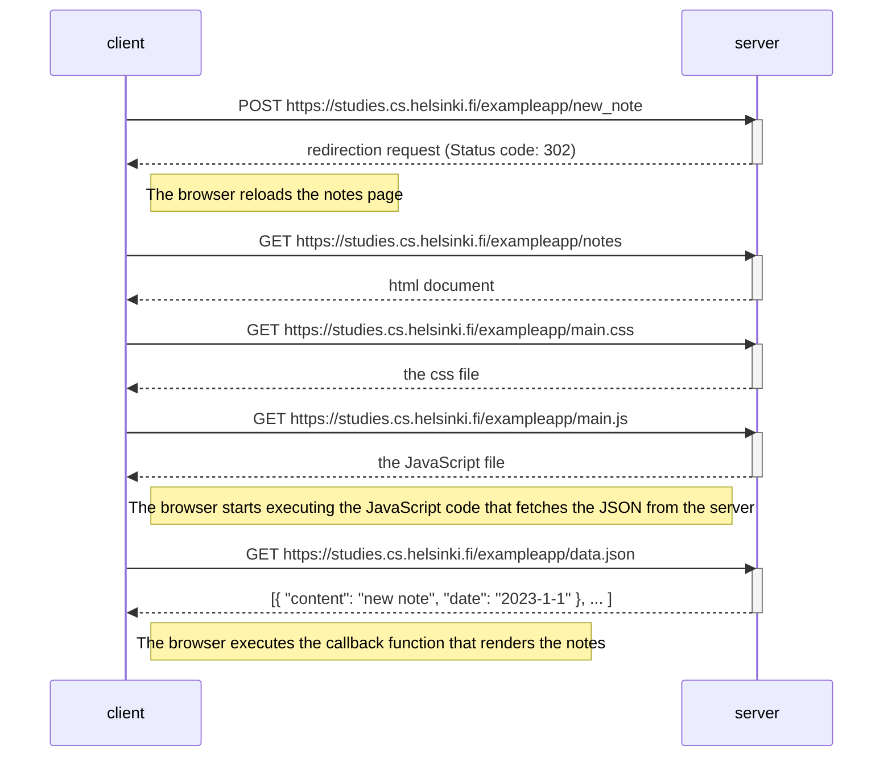
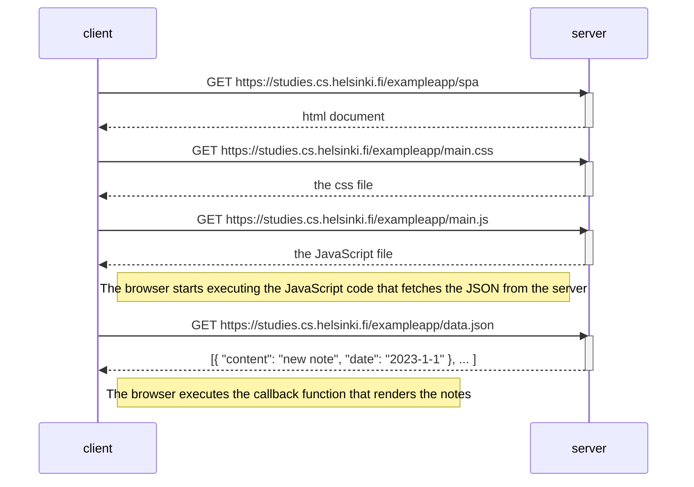

## 0.4: new note



## 0.5: Single Page App



## 0.6: New note
```mermaid
    sequenceDiagram
    participant client
    participant server

    client->>server: POST https://studies.cs.helsinki.fi/exampleapp/new_note_spa
    Note right of client: The data included in the request is in json format already.
    activate server
    server-->>client: The browser renders the note
    Note right of client: The browser uses the corrsponding JS code to do so.